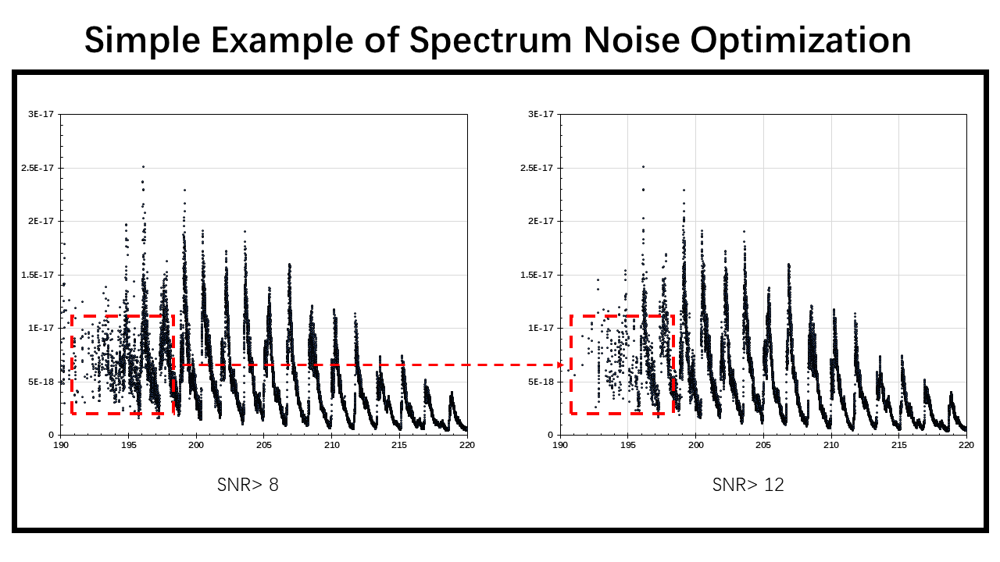
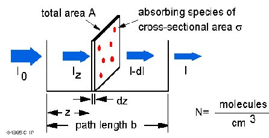

<!-- MathJax 公式书写 -->
<head>
    
    
</head>

> SNR (Signal-to-noise ratio) is a widely used sclae in science and engineering field to compare the strength of desired signal with the strength of the background noise. In practical application, havung a larger SNR means tha the data is more reliable.  

### The Beer-Lambert Law and Absorption Cross-Sections

When a beam of light passes through light-absorbing molecules, energy is transferred to the absorbing molecules, so the intensity of the light gradually decreases. _**Pierre Bouguer**_, a mathematician, geophysicist, geodesist and astronomer, and _**Johann Heinrich Lambert**_, a physicist, mathematician and astronomer, observed that the fraction of light source that is transmitted ($I/I_o$) is independent of $I_o$, elucidated the relationship between the degree of absorption of light by a substance and the thickness of the absorbing medium in 1729 and 1760, respectively. _**August Beer**_, a German physicist, chemist and mathematician of Jewish descent, proposed a similar relationship between the degree of absorption of light and the concentration of light-absorbing substances in 1852. The two combined to obtain the basic law of light absorption Burger-Lambert-Beer law, referred to as Beer-Lambert law.  

The main content of the Beer-Lambert law is that the decrease in the light intensity, or **irradiance** ($I$) over the course of a small volume element is proportional to the irradiance of the light entering the element, the **concentration** of absorbers ($C$), and the **length** of the path through the absorbing medium ($dx$):  

\begin{equation}
\frac{d I}{d x}=-\varepsilon^{\prime} I C
\end{equation}

The proportionality constant (*$ \varepsilon^{\prime} $*) depends on the wavelength of the light source and on the light absorber's properties such as structure, orientation and environment. Integrating Eq. above can show that if the light source with irradiance $I_o$ is incident on a cell of thickness $l$, the irradiance of the transmitted light expression can be shown as:

\begin{equation}
I=I_{o} \exp \left(-\varepsilon^{\prime} C l\right)=I_{o} 10^{-\varepsilon C l} \equiv I_{o} 10^{-A}
\end{equation}

Where $A$ is the **absorbance** or **optical density** of the sample ($ A = \varepsilon C l$) and $ \varepsilon $ is called the **molar extinction coefficient** or **molar absorption coefficient** ($ \varepsilon = \varepsilon^{\prime} / ln(10) $). The absorbance is a dimensionaless quantity, so if $ C $ is given in units of molarity (1 **M** = 1 mol/l) and $ c $ in cm, $ \varepsilon $ thus has dimensions of **M**-1 cm-1.

**How do we apply the Beer-Lambert law to spectral cross-section measurement?**

The Beer-Lambert law can be derived from an appproximation for the absorption coefficient for a molecule by approximating the molecule by an opaque disk whose cross-sectional area, $\sigma$, represents the effective area seen by a photon of frequency $w$. If the frequency of the light is far from resonance, the area is approximately 0, and if $w$ is close to resonance the area is a maximum. Taking an infinitesimal slab, $dz$, of sample:

Where $I_o$ is the light intensity entering the sample at $ z = 0 $, $ I_z $ is the intensity enthering the infinitesimal slab at $ z $, $ dI $ is the light intensity absorbed in the slab, and $ I $ is the intensity of light leaving the sample. Then the toal opaue area on the slab due to the absorbers is $\sigma * N * A * dz$. Then, the fraction of photons absorbed will be $\sigma * N * A * dz / A $ so,

\begin{equation}
d I / I_{z}=-\sigma * N * d z
\end{equation}

Integrating this equation from $z = 0$ to $z = b$ gives,

\begin{equation}
\ln (I)-\ln \left(I_{a}\right) &=-\sigma * N * b
\end{equation}

or

\begin{equation}
-\ln \left(I / I_{0}\right) &=\sigma * N * b
\end{equation}

### The Interferometry
