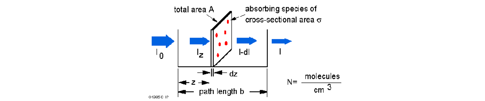
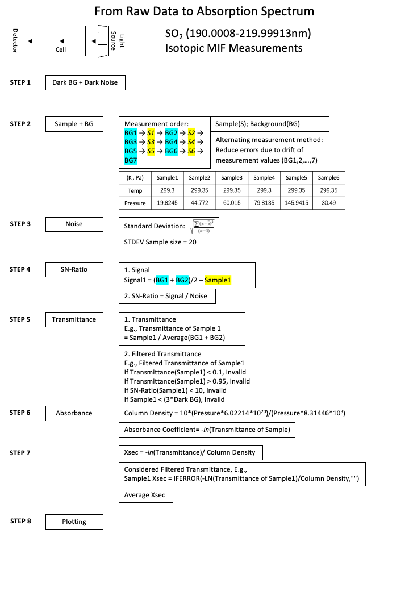
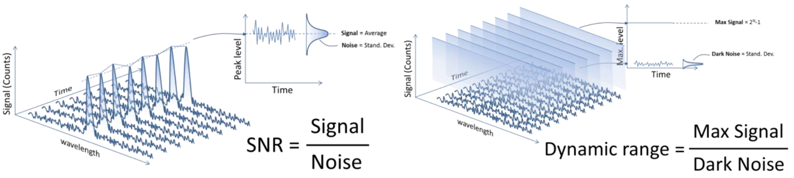
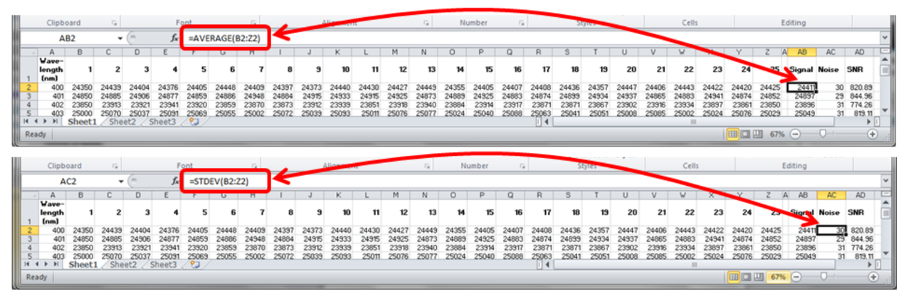
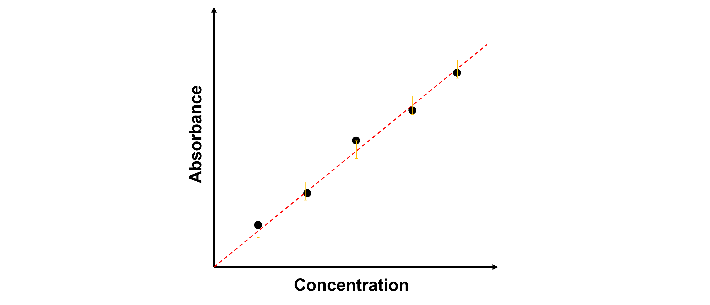

<!-- MathJax 公式书写 -->
<head>
    
    
</head>

> SNR (Signal-to-noise ratio) is a widely used sclae in science and engineering field to compare the strength of desired signal with the strength of the background noise. In practical application, havung a larger SNR means tha the data is more reliable.  

### 1. The Beer-Lambert Law and Absorption Cross-Sections

When a beam of light passes through light-absorbing molecules, energy is transferred to the absorbing molecules, so the intensity of the light gradually decreases. _**Pierre Bouguer**_, a mathematician, geophysicist, geodesist and astronomer, and _**Johann Heinrich Lambert**_, a physicist, mathematician and astronomer, observed that the fraction of light source that is transmitted ($I/I_o$) is independent of $I_o$, elucidated the relationship between the degree of absorption of light by a substance and the thickness of the absorbing medium in 1729 and 1760, respectively. _**August Beer**_, a German physicist, chemist and mathematician of Jewish descent, proposed a similar relationship between the degree of absorption of light and the concentration of light-absorbing substances in 1852. The two combined to obtain the basic law of light absorption Burger-Lambert-Beer law, referred to as Beer-Lambert law.  

The main content of the Beer-Lambert law is that the decrease in the light intensity, or **irradiance** ($I$) over the course of a small volume element is proportional to the irradiance of the light entering the element, the **concentration** of absorbers ($C$), and the **length** of the path through the absorbing medium ($dx$):  

\begin{equation}
\frac{d I}{d x}=-\varepsilon^{\prime} I C
\end{equation}

The proportionality constant (*$ \varepsilon^{\prime} $*) depends on the wavelength of the light source and on the light absorber's properties such as structure, orientation and environment. Integrating Eq. above can show that if the light source with irradiance $I_o$ is incident on a cell of thickness $l$, the irradiance of the transmitted light expression can be shown as:

\begin{equation}
I=I_{o} \exp \left(-\varepsilon^{\prime} C l\right)=I_{o} 10^{-\varepsilon C l} \equiv I_{o} 10^{-A}
\end{equation}

Where $A$ is the **absorbance** or **optical density** of the sample ($ A = \varepsilon C l$) and $ \varepsilon $ is called the **molar extinction coefficient** or **molar absorption coefficient** ($ \varepsilon = \varepsilon^{\prime} / ln(10) $). The absorbance is a dimensionaless quantity, so if $ C $ is given in units of molarity (1 **M** = 1 mol/l) and $ c $ in cm, $ \varepsilon $ thus has dimensions of **M**-1 cm-1.

**How do we apply the Beer-Lambert law to spectral cross-section measurement?**

The Beer-Lambert law can be derived from an appproximation for the absorption coefficient for a molecule by approximating the molecule by an opaque disk whose cross-sectional area, $\sigma$, represents the effective area seen by a photon of frequency $w$. If the frequency of the light is far from resonance, the area is approximately 0, and if $w$ is close to resonance the area is a maximum. Taking an infinitesimal slab, $dz$, of sample:

Where $I_o$ is the light intensity entering the sample at $ z = 0 $, $ I_z $ is the intensity enthering the infinitesimal slab at $ z $, $ dI $ is the light intensity absorbed in the slab, and $ I $ is the intensity of light leaving the sample. Then the toal opaue area on the slab due to the absorbers is $\sigma \cdot N \cdot A \cdot dz$. Then, the fraction of photons absorbed will be $\sigma \cdot N \cdot A \cdot dz / A $ so,

\begin{equation}
d I / I_{z}=-\sigma  N  d z
\end{equation}

Integrating this equation from $z = 0$ to $z = b$ gives,

\begin{equation}
ln(I) - ln(I_o) = -\sigma  N  b
\end{equation}

or,

\begin{equation}
-ln(\frac{I}{I_o}) = \sigma  N  b
\end{equation}

Let's organize cross-section $\sigma$ to one side of the equation and replace $b$ with path length $z$ of the measured cell,

\begin{equation}
\sigma=-\frac{1}{N z} \ln \frac{I}{I_{o}}=-\frac{R T}{P N_{A} z} \ln \frac{I}{I_{0}}
\end{equation}

Where $N$ is the number density of absorbing molecules, $z$ is the path length of the cell, $R$ is the gas constant, $T$ is the temperature, $N_{A}$ is the Avagadro number and $P$ is the pressure. Noted the calculation of number density uses the ideal gas law with the elements provided as following. Hence the cross-section $\sigma$ can be easily derived from measuring the incident lignt intensity and detected intensity after energy absorbing.

### 2. The Ideal Gas Equation and Molecule Number Density

The gas molecule inside an enclosed vessel follows thermal movement, bringing collsion and exerting a force on the wall of the vessel. The large number of collisions that occur in all gas molecule results in the same pressure at any point in the vessel, regardless of where and in what direction the measurement is made.

One mole of substance contains 6.022×1023 molecules or atoms, speaking of gas, under standard atmosphere condition (101,325 Pa; 273.15 K), one mole of an ideal gas fills a volume of 22.414 L. Back in 1664, Robert Boyle did research on the relationship between gas pressure and gas volume and reached the Boyle-Mariotte law:

\begin{equation}
p \cdot v= \text{ const. }
\end{equation}

Which expresses that the volume of a given quantity of a gas at the constant temperature is inversely proportional to the pressure.

One hundred years later, Jacques Charles and Joseph Gay-Lussac stated the temperature dependence of the volume of a quantity of gas that the volume of a given quantity of gas at a constant pressure is directly proportional to the absolute temperature, which is expressed as the Gay-Lussac’s law:

\begin{equation}
V = \text{ const. } \cdot T
\end{equation}

Subjecting a certain amount of gas to continuous pressure changes and temperature changes, we get:

\begin{equation}
\frac{p \cdot V}{T}=\operatorname{const.}
\end{equation}

When we consider the molecule number of the gas, we obtain that the volume of the gas is proportional to the amount of substance ν of the gas molecules for a given temperature and a given pressure. The expression is:

\begin{equation}
\frac{p \cdot V}{T}= \nu \cdot \text { const. }
\end{equation}

It can also be written as:

\begin{equation}
p \cdot V=\frac{m}{M} \cdot R \cdot T
\end{equation}

Where

| $p$ | Pressure | [Pa] |
| $V$ | Volume | [m3] |
| $m$ | Mass | [kg] |
| $M$ | Molar mass | [kg  kmol-1] |
| $R$ | General gas constant | [kJ kmol-1 K-1] |
| $T$ | Absolute temperature | [K] |

Besides, the substance amount ν can be indicated as the molecule number in relation to the Avogadro constant N_A, and it is expressed as (also known as the ideal gas equation $I$):

\begin{equation}
p \cdot V=\frac{N}{N_{A}} \cdot R \cdot T=N \cdot k \cdot T \quad \text { where } k=\frac{R}{N_{A}}
\end{equation}

Where

| $N$ | Molecule numbers | |
| $N_{A}$ | Avogadro constant | 6.022×1023 [mol-1] |
| $k$ | Boltzmann constant | 1.381×10-23 [J K-1] |

When both sides of the ideal gas equation are divided by the volume, then we can obtain the ideal gas equation II, which is expressed as:

\begin{equation}
p = n \cdot k \cdot T
\end{equation}

Where

| $n$ | Particle number density | [molecule m-3] |

**Why do we use molecule number density as the expression of pressure?**

In experiments for spectral measurements, the concentration of the sample to be measured is usually reduced in order to avoid complete absorption of the light source signal due to high sample concentration. Also, to avoid the influence of oxygen, carbon dioxide and moisture in the air on the spectrogram, many high-precision spectrometers generate a vacuum-like environment with extremely low air pressure inside. 

According to the equations above, the pressure is proportional to the molecule number density. Notes that even at a pressure of 10-12 hPa, there is still 26,500 molecule per cm-3 be present. It is increasingly ineffective to express pressure in the unit of Pascal at extremely low pressure, it is better to be recorded by the particle number density.

 Conversion table for unit of pressure 

|        |    Pa    |    bar    |    hPa    |   µbar   |    Torr   |  micron  |    atm    |     at    |   mm WS   |    psi    |    psf    |
|:------:|:--------:|:---------:|:---------:|:--------:|:---------:|:--------:|:---------:|:---------:|:---------:|:---------:|:---------:|
| Pa     | 1        | 1·10-5    | 1·10-2    | 10       | 7.5·10-3  | 7.5      | 9.87·10-6 | 1.02·10-5 | 0.102     | 1.45·10-4 | 2.09·10-2 |
| bar    | 1·105    | 1         | 1·103     | 1·106    | 750       | 7.5·105  | 0.987     | 1.02      | 1.02·104  | 14.5      | 2.09·103  |
| hPa    | 100      | 1·10-3    | 1         | 1,000    | 0.75      | 750      | 9.87·10-4 | 1.02·10-3 | 10.2      | 1.45·10-2 | 2.09      |
| µbar   | 0.1      | 1·10-6    | 1·10-3    | 1        | 7.5·10-4  | 0.75     | 9.87·10-7 | 1.02·10-6 | 1.02·10-2 | 1.45·10-5 | 2.09·10-3 |
| Torr   | 1.33·102 | 1.33·10-3 | 1.33      | 1,330    | 1         | 1,000    | 1.32·10-3 | 1.36·10-3 | 13.6      | 1.93·10-2 | 2.78      |
| micron | 0.133    | 1.33·10-6 | 1.33·10-3 | 1.33     | 1·10-3    | 1        | 1.32·10-6 | 1.36·10-6 | 1.36·10-2 | 1.93·10-5 | 2.78·10-3 |
| atm    | 1.01·105 | 1.013     | 1,013     | 1.01·106 | 760       | 7.6·105  | 1         | 1.03      | 1.03·104  | 14.7      | 2.12·103  |
| at     | 9.81·104 | 0.981     | 981       | 9.81·105 | 735.6     | 7.36·105 | 0.968     | 1         | 1·10-4    | 14.2      | 2.04·103  |
| mm WS  | 9.81     | 9.81·10-5 | 9.81·10-2 | 98.1     | 7.36·10-2 | 73.6     | 9.68·10-5 | 1·10-4    | 1         | 1.42·10-3 | 0.204     |
| psi    | 6.89·103 | 6.89·10-2 | 68.9      | 6.89·104 | 51.71     | 5.17·104 | 6.8·10-2  | 7.02·10-2 | 702       | 1         | 144       |
| psf    | 47.8     | 4.78·10-4 | 0.478     | 478      | 0.359     | 359      | 4.72·10-4 | 4.87·10-4 | 4.87      | 6.94·10-3 | 1         |

### 3. From Raw Signal to Cross-Sections
The general workflow of calculating cross-sections from the raw data is simplely illustrated as the figure below. 

#### 3.1 Drifting Effect Precaution

The measuring procedure (Step 2 above) is designed to work against the deuterium lamp (the UV light souce) intensity drifting. Considering the light intensity keeps decreasing during the measurements, the same time interval is used to measure the background signal and the sample signal sequentially, and the average of the two adjacent background signals is used to represent the reference background signal of the sample signal measured in the middle of the two background signal measurements. So that this can reduce the drifting effect.

#### 3.2 Signal-to-Noise Ratio and Dynamic Range Definition

The Signal-to-Noise Ratio (SNR) and Dynamic Range (DR) are two common parameters used to spefify the electrical performance of a spectrometer. Although a consensus seems to have been reached, it is very rare to find decent description of how to calculating noise. Here we will talk about how they are defined and how to measure and calculte them in the spectral measurements.

The [Ibsen photonics Inc. ducument](https://ibsen.com/wp-content/uploads/Tech-Note-The-Signal-to-Noise-Ratio-SNR-and-Dynamic-Range-DR.pdf) gives delicate illustrations of SNR and DR as shown above. It points out that the range if digital signal output from the spectromeyter is usually $0$ to $2^{N}-1$, where $N$ is the number of bits in the Analogue-to-Digital (A/D) converter on the electronics. And typically, the $N$ number range from 10 to 16, i.e., the maximum signal level range between 1,023 to 65,535 counts.

Noise is the random variation of the signal around the mean value. The left panel of the above figure shows a spectrum with a sigle peak in wavelength and time. The peak signal level will fluctuate a small amount around the average value due to noise from the electronics. The noise is measured by the Root-Mean-Square (RMS) value of the fluctuations.

SNR is defined as signal level divided by noise level. It is suggested that in order to get an accurate result for teh SNR usually it is required to measure over 25-50 time samples of the spectrum. The figure below shows an example how to calculate average signal and noise using excel.

The dynamic range is defined as the maximum possible signal level divided by the noise level when no light enters the spectrometer, and is called dark noise of the spectrometer. It is measured by taking 25-50 dark level measurements and calculating the RMS level with standard deviation function for each wavelength. The DR is then calculated as $2^{N}-1$ divided by the dark noise.

### 4. Data Filtering Using Gradient Descent

#### 4.1 Linearity of Absorbance and Concentration

We assume a beam of light passes through sample cell in the spectrometer, and when part of the energy, which represents a specific wavelength of light, is absorbed by the sample, the intensity of the light emitted from the sample cell $I$ will be lower than the incident light intensity $I_{o}$.

The term absorbance is used for illustrating the phenomenon, given the symbol, A. Expressed as

\begin{equation}
A= log_{10}(\frac{I_{o}}{I})=\epsilon l c
\end{equation}

Where $A$ is the absorbance, $ε$ is the molar attenuation coefficient or absorptivity of the attenuating species, $l$ is the optical path length in cm, and $c$ is the concentration of the attenuating species. From the above equation, it can be deduced that absorbance $A$ is directly proportional to the concentration $c$.

In the actual absorption spectroscopy measurements, intercepting the spectra data at a particular wavelength under all concentration environments yields a plot demonstrating a linear relationship between absorbance and concentration, and the fitted linear relationship has an intercept of 0. During high resolution measurements, tens of thousand lines of dataset needs to be analyzed, generizing numerous dataset comparison and filtering work, which is ideal for machine learning workflow.

#### 4.2 Linear Regression using LAD algorithm 

<!-- ### The Interferometry -->

