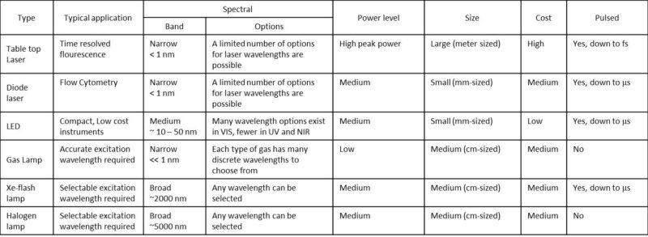

There are basically 2 types of fluorescence spectroscopy instrument configurations - transmissive and reflective as shown below.

The **reflective fluorescence spectroscopy** has a dichroic mirror that directs the excitation light to the sample and collects the emission light from the sample.

The transmissive fluorescence spectroscopy has the configuration that the sample is excited directly from the light source and the emission light is collected at the angle of 90 degree measured from the excitation light.

A fluorescence spectroscopy instrument consists of the following basic components:

1. [Light Sources](#LightSources)
2. [Excitation Filters](#ExcitationFilters)
3. [Sample Holder](#SampleHolder)
4. [Dichroic Filter](#DichroicFilter)
5. [Emission Filters](#EmissionFilters)
6. [Detectors](#Detectors)

## Light Sources {#LightSources}

Fluorescence spectroscopy can use almost all types of light sources so the best choice depends on the actual requirements of spectral wavelength coverage, intensity, size, cost, efficiency, and whether the light source needs to be pulsed.

The table below shows most common types of light sources and the key characteristics of these. In general, LEDs are a great choice if you want to build a low cost, compact fluorescence instrument for analyzing a limited number of known fluorophores. 
Pulsed table top lasers are often the preferred choice if you need very accurate time resolved measurements with nanosecond timing. 
And broadband sources are the best choice if you need the flexibility to analyze a large set of unknown fluorophores and thus need to select almost any excitation wavelength.

## Excitation Filters {#ExcitationFilters}

Variable optical band pass filters are mostly realized as scanning grating monochromators and are used together with broadband light sources to select the right excitation wavelength. 
The main benefit is of course the flexibility to choose any wavelength but the drawback is the high cost, large size, need for electronics control, 
and stability issues due to the moving parts inside the monochromator. Therefore, variable bandpass filters are mostly used in versatile large laboratory instruments. 

The fixed filter’s main benefits are that they are small, simple, relatively low cost and very stable. However, the price you pay is a limited flexibility in the choice of excitation wavelength.
Some instruments come with the option to select between a set of filters with different center wavelength. For this reason,
fixed filters are mostly used in handheld/portable lower-cost fluorescence instruments for dedicated applications.

In summary, the excitation filters are divided into two categories:

1. Fixed low pass/band  pass filters
2. Variable band pass filters

## Sample Holder {#SampleHolder}

The choice of sample holder really depends on the application. The main issue to consider is that in the case of a transmissive cuvette or flow cell, you must make sure that the material of the sample holder is transparent to both excitation and emission wavelengths. 
This is especially important for UV wavelengths, as most glasses absorb light, so special types of materials need to be used.

## Dichroic Filter {#DichroicFilter}

Dichroic filters are used in a 45 degree configuration. The function of a dichroic filter is to reflect the excitation light (shorter wavelengths) and transmit the emission light (longer wavelengths). 
For really simple systems, dichroic filters can actually be used as both excitation and emission filters.

## Emission Filters {#EmissionFilters}

Variable optical band pass filters are mostly realized as scanning grating monochromators and are used to select the right peak emission wavelength. The main benefit is the flexibility to choose any wavelength but the drawback is a high cost, large size, need for electronics control and stability issues due to the moving parts inside the monochromator. Therefore, variable bandpass filters are mostly used in versatile large laboratory instruments.

The fixed filters main benefit is that they are small, simple, relatively low cost and very stable. However, the price you pay is a limited flexibility in the choice of emission wavelength. You may design your fluorescent instrument with multiple filters but, when you need more than 3 – 4 filter this very quickly becomes bulky and expensive.

Full spectrum diode array spectrophotometers will – as the name says – collect the full spectrum. This means you have all emission peaks and details about their shape and the background level. For this reason, diode array spectrophotometers are a good choice when you are going to measure multiple fluorophores and/or more complex spectra.

In summary, the emission filters are divided into 3 categories:

1. Fixed low band pass filters
2. Variable band pass filters
3. Full spectrum diode array spectrophotometers

## Detectors {#Detectors}

In fluorescence spectroscopy, it is common to use **Photo Multiplying Tubes** (PMT) as detectors due to the high sensitivity and fast response of these detectors. However, **Silicon-based solid-state detectors** can also be used.

The number of detectors needed depends on the system configuration as shown in the figure below. (1) If you are using a variable band pass filter (like a monochromator) you only need one detector. (2) If you are using fixed bandpass filters, you need one detector per filter. (3) If you are going to analyze multiple emission wavelengths this however, very quickly becomes bulky and expensive and a diode array spectrometer will be the preferred option. The diode array spectrometer will typically include hundreds of detectors.

