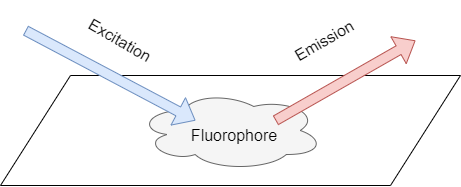
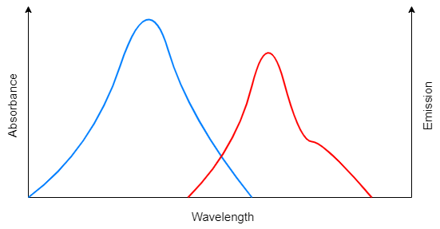
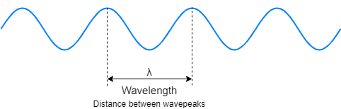
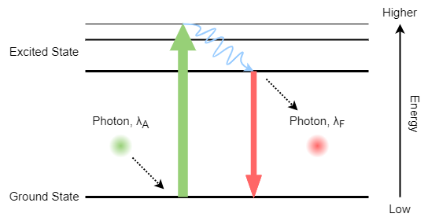

 

#### Table of Content ####
1. [What is fluorescence?](#what)
2. [Excitation & Emission Spectra](#spectra)
3. [Photon Energy & Wavelength](#photon)
4. [Energy Diagram (*Jablonski*)](#diagram)
5. [Timing](#time)

****

## What is fluorescence? {#what}

**Fluorescence** is the phenomenon that a material emits light at one wavelength when it is illuminated at another. 
The material which has this ability is called fluorophore (*aka* fluorescent dyes, labeling reagents, stains, *etc.*)

## Excitation & Emission Spectra {#spectra}

Here shows an excitation and emission spectra example. The fluorophore always absorbs light at a lower wavelength 
(excitation, blue line) and emits light at a longer wavelength (emission, red line).

So how do molecules exchange energy with light and produce such characteristic spectrograms? 
We can explain this by looking at electromagnetic waves and how they carry energy.

## Photon Energy & Wavelength {#photon}

Light can be described as electromagnetic waves with a wavelength $\lambda$ and a speed $c$ (the speed of light).

Meanwhile, light can be described as a particle which is called a photon. 
Each photon carries a small amount of energy that is related to its speed and wavelength. 
The relationship between photon’s energy $E$, speed $c$, and wavelength $\lambda$ is given as:

\begin{equation}
E = \mathrm{h} \frac{c}{\lambda}
\end{equation}

Where $\mathrm{h}$ is the Plank’s constant. This equation indicates that the energy of the photon is inversely proportional to its wavelength,
which means the longer the wavelength, the lower the energy the photon carries.

## Energy Diagram (*Jablonski*) {#diagram}

Normally, the fluorophore molecule will be in its ground state, when it is excited by a photon with a specific wavelength, 
which also means the photon carries a specific amount of energy, the fluorophore molecule can absorb that amount of energy and the energy 
state of the fluorophore molecule can raise to the excited state (Green arrow).

Typically, the excited state molecule will relax a bit to an upper steady state, and then the molecule energy state can go down to the ground state again 
(Red arrow). By doing so, it will emit a smaller amount of energy or a photon with a longer wavelength.

This process can occur repeatedly, the key point here is that the energy that is absorbed is higher than the energy that is emitted. 
When it converts to wavelength, the fluorophore always absorbs light with a shorter wavelength and emits light with a longer wavelength. 

## Timing {#time}

Fluorescence is a very fast process, from the time a photon is absorbed by a fluorophore to the time a photon is emitted is very short, 
usually only in nanosecond scale or something like that. The time resolved fluorescence spectroscopy can be used along with pulsed light sources.

Some special fluorophores have longer decay times in micro- and milli-second decay times. Choosing the appropriate detectors and filters can help 
improve the signal-to-noise ratio.
